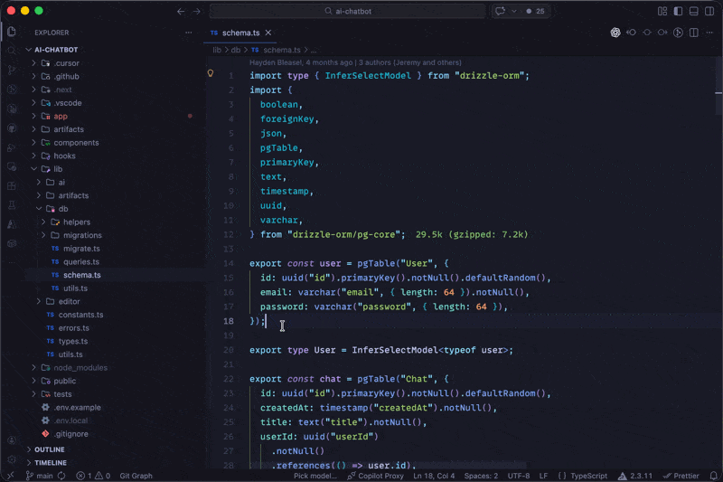
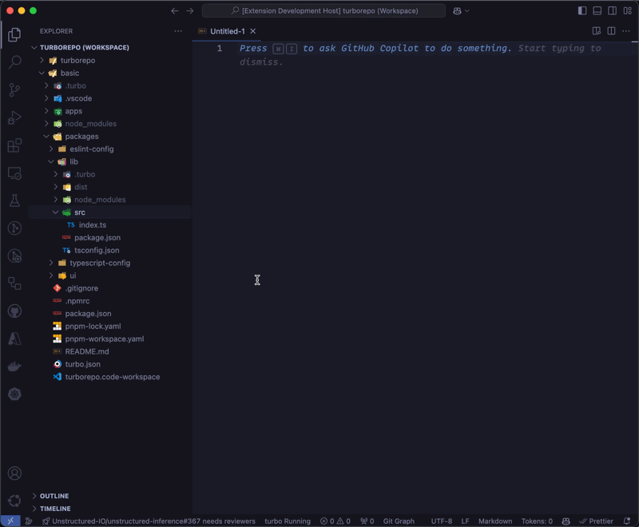
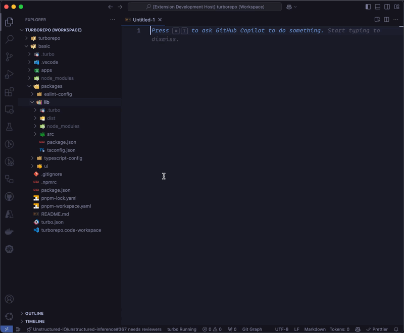
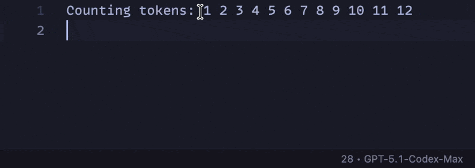

<h1 align="center">MarkTree</h1>

<p align="center">
  <strong>MarkTree is a Swiss Army Knife for AI-assisted development</strong> — built for fast, clean context sharing from VS Code.<br/>
  Copy structured Markdown context in seconds and keep your agent loops moving.
</p>

<p align="center">
  <em>Directory trees • file contents • selections • tabs • symbols • Problems panel • Git diffs • token counting • chunking</em>
</p>

---

## What you get

MarkTree turns your workspace context into **paste-ready Markdown**:

- **Right-click → Copy → Paste into your agent** (ChatGPT / Claude / Gemini / Copilot Chat / Cursor / Continue / etc.)
- **Readable, structured output** with stable paths and fenced code blocks
- **Local-first by default**: your code stays on your machine (see [Privacy](#privacy--security))

---

## See it in action

### Copy selection as Markdown



### Copy a Markdown directory tree



### Copy file contents as Markdown



### Copy a tree _and_ the files under it


### Live token counter (status bar)



---

## Why MarkTree

When working with AI assistants, the slowest part is usually collecting and formatting context.

MarkTree removes that glue work:

- **No more copy/paste loops across files**
- **No more hand-built directory trees**
- **No more missing file context**
- **No more rough token estimates**

---

## Quick start

1. Install **MarkTree** from the VS Code Marketplace.
2. In the Explorer, **right-click** a folder or file:
   - **MarkTree → Copy Md Tree**
   - **MarkTree → Copy Md File(s)**
   - **MarkTree → Copy Md Tree & Files**
3. Paste into your agent/chat/issue/PR.

---

## Commands (what’s included)

### Core “copy context” commands (Free)

- **Copy Md Tree** — copy a directory outline as Markdown
- **Copy Md File(s)** — copy one or many files as Markdown (with code fences)
- **Copy Md Tree & Files** — include the tree preview + the file contents
- **Copy Selected as Markdown** (editor selection; in diff editors, choose between copying the selection or the selection diff)
- **Copy as Markdown** (terminal selection)
- **Copy Problems as Markdown** (quick-pick: Copy Problems for Active File, Copy All Problems)
- **Copy Symbol as Markdown** (pick a function/class/etc.)
- **Copy Tab(s) as Markdown** (quick-pick: Copy Active Tab as Markdown, Copy all open tabs in this window, Copy tabs to the left of the active tab, Copy tabs to the right of the active tab; when diff tabs are included, choose once whether diff tabs copy as tab default, before, after, or diff)
- **Add to MD Ignores** / **Remove from MD Ignores** (quickly tweak ignore list)

### AI utilities (Free)

- **Select Token Counter Model** — pick a model to count tokens accurately
- **Clear Model Cache** — refetch model metadata used by token counter

### Pro features (requires a MarkTree Pro license)

- **(Pro) Copy Staged Git Changes as Markdown**
- **(Pro) Copy Selected Git Commits** (copies diffs for chosen commits)
- **(Pro) Generate Structure from Clipboard Tree** (scaffold folders/files from a Markdown tree)
- **(Pro) Chunk Editor by Model Size** (split big files/selections into model-friendly chunks)

---

## Output format (what you paste)

MarkTree generates Markdown like:

- Optional **tree preview** (in a fenced block)
- Then **one section per file**, with a path header and a fenced code block

This keeps boundaries clear for both agents and humans.

---

## Configuration

Open **Settings** and search for “MarkTree”, or add to your `settings.json`:

```json
{
  "marktree.gitignore": true,
  "marktree.ignoreBinary": true,
  "marktree.followSymlinkDirectories": true,
  "marktree.additionalIgnores": [".git", ".vscode/", "pnpm-lock.yaml"],
  "marktree.showCopyingMessage": false,
  "marktree.showCopiedMessage": true,

  "marktree.showTokenCounter": true,

  "marktree.showFilePath": true,
  "marktree.showCodeLineNumbers": true,
  "marktree.showFilenameLineRanges": true,
  "marktree.showFilenameColumnRanges": true,

  "marktree.copyWorker.logLevel": "info",
  "marktree.copyWorker.logPath": ""
}
```

Notes:

- **`marktree.gitignore`** / **`marktree.additionalIgnores`**: keeps copied context focused.
- **`marktree.ignoreBinary`**: skips binary contents.
- **`marktree.followSymlinkDirectories`**: follows symlinked directories during tree/file copy.
- **`marktree.showFilePath`**, **`marktree.showCodeLineNumbers`**, **`marktree.showFilenameLineRanges`**, **`marktree.showFilenameColumnRanges`**: control copied Markdown headers and location metadata.
- **`marktree.showTokenCounter`**: toggles the live token counter in the status bar.
- **`marktree.copyWorker.*`**: controls copy worker logging.

---

## MarkTree Pro

MarkTree Pro is for teams and individuals in heavy agentic loops:

- Paste **staged diffs** or **selected commit diffs** instantly
- Turn a **Markdown tree into a scaffold** in seconds
- **Chunk large files** to fit model limits (tokenizer + overlap controls)

To activate:

1. Run **“MarkTree: Enter License Key”**
2. Paste your key
3. Pro commands unlock automatically

---

## Privacy & Security

MarkTree is designed to be **local-first** for copy/context features:

- Workspace content (paths, files, tree, selections, diagnostics, Git output) is processed **on your machine**
- MarkTree **does not** collect analytics/telemetry
- Content is copied only to **your clipboard**

Network access happens only for:

- **Pro license validation** (your license key is sent to the licensing endpoint)
- **Model metadata fetch** for the token counter (OpenRouter model listings)

Read the full policy in **`PRIVACY_POLICY.md`**.

---

## Troubleshooting (common gotchas)

- **“Why didn’t it copy some files?”**
  Check `marktree.gitignore` and `marktree.additionalIgnores`.

- **“Binary file: content not displayed”**
  That is intentional when `marktree.ignoreBinary` is enabled.

- **Token counter says “Models unavailable”**
  The model list fetch failed (network/offline). Try again later or run **Clear Model Cache**.

---

## Support

If MarkTree saves you time, consider upgrading to Pro or sharing it with your team.
