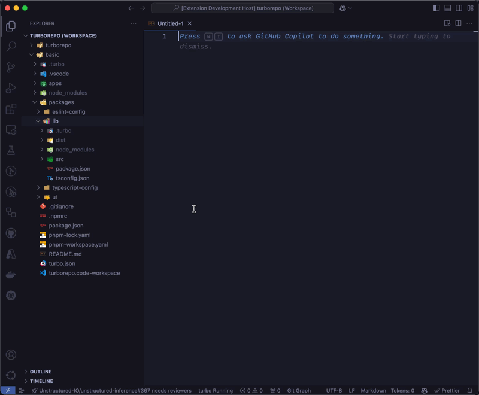

<h1 align="center">MarkTree</h1>

<p align="center">
  <strong>MarkTree is basically a Swiss Army Knife for AI Development</strong> — built for working with <em>any</em> agentic coding system.<br/>
  Copy clean, LLM-ready Markdown context from VS Code in seconds. It will save you countless hours.
</p>

<p align="center">
  <em>Directory trees • file contents • selections • tabs • symbols • Problems panel • Git diffs • token counting • chunking • Copilot Proxy</em>
</p>

---

## What you get

MarkTree turns your workspace context into **paste-perfect Markdown**—and gives you a **Copilot Proxy** so you can reuse your GitHub Copilot seat in tools that speak OpenAI- or Anthropic-style APIs.

- **Right-click → Copy → Paste into your agent** (ChatGPT / Claude / Gemini / Copilot Chat / Cursor / Continue / etc.)
- **Readable, structured output** with paths + fenced code blocks
- **Local-first by default**: your code stays on your machine (see [Privacy](#privacy--security))
- **Copilot Proxy (opt-in)**: start a local bridge and point compatible tools at it—no extra API keys required (you use your existing Copilot sign-in)

---

## See it in action

### Copy a Markdown directory tree


### Copy file contents as Markdown



### Copy a tree _and_ the files under it


### Live token counter (status bar)


---

## Why MarkTree (especially for AI / agentic workflows)

When you’re working with an AI assistant, the biggest time sink is always the same: **collecting and formatting context**.

MarkTree removes the glue work:

- **No more “copy file… paste… repeat…”**
- **No more hand-writing directory trees**
- **No more “what files am I missing?”**
- **No more guessing token limits**

And if you use GitHub Copilot: the **Copilot Proxy** lets you bring that same Copilot-powered experience into other tools—without juggling provider keys or accounts.

---

## Quick start

1. Install **MarkTree** from the VS Code Marketplace.
2. In the Explorer, **right-click** a folder or file:
   - **MarkTree → Copy Md Tree**
   - **MarkTree → Copy Md File(s)**
   - **MarkTree → Copy Md Tree & Files**
3. Paste into your agent/chat/issue/PR. Done.
4. Optional: start the **Copilot Proxy** from the status bar or run **MarkTree: Start Copilot Proxy** to use your Copilot seat from OpenAI/Anthropic-compatible clients.

---

## Commands (what’s included)

### Core “copy context” commands (Free)

- **Copy Md Tree** — copy a directory outline as Markdown
- **Copy Md File(s)** — copy one or many files as Markdown (with code fences)
- **Copy Md Tree & Files** — include the tree preview + the file contents
- **Copy Active Tab as Markdown** (includes diff views)
- **Copy Selected as Markdown** (editor selection)
- **Copy as Markdown** (terminal selection)
- **Copy Problems for Active File**
- **Copy All Problems** (workspace Problems panel)
- **Copy Symbol as Markdown** (pick a function/class/etc.)
- **Copy Tab(s) as Markdown** (quick-pick: Copy Active Tab as Markdown, Copy all open tabs in this window, Copy tabs to the left of the active tab, Copy tabs to the right of the active tab)
- **Add to MD Ignores** / **Remove from MD Ignores** (quickly tweak ignore list)

### AI utilities (Free)

- **Select Token Counter Model** — pick a model to count tokens accurately
- **Clear Model Cache** — refetch model metadata (used by the token counter)

### Copilot Proxy (Free)

- **Start Copilot Proxy** — run a local server backed by your VS Code GitHub Copilot session
- **Stop Copilot Proxy** — stop the proxy (also available via the status bar toggle)

### Pro features (requires a MarkTree Pro license)

- **(Pro) Copy Staged Git Changes as Markdown**
- **(Pro) Copy Selected Git Commits** (copies diffs for chosen commits)
- **(Pro) Generate Structure from Clipboard Tree** (scaffold folders/files from a Markdown tree)
- **(Pro) Chunk Editor by Model Size** (split big files/selections into model-friendly chunks)

---

## Copilot Proxy

Sometimes you want Copilot’s models **outside** of VS Code—inside a CLI tool, a small script, or another app that already knows how to talk to “OpenAI-compatible” or “Claude-compatible” endpoints.

That’s exactly what the Copilot Proxy is for.

**What it does:**

- Starts a **local** server on your machine
- Proxies requests to your GitHub Copilot session
- Responds in familiar OpenAI/Anthropic formats, so many tools work with minimal setup

**What it doesn’t do:**

- It doesn’t replace Copilot. You still need an active Copilot seat and to be signed in inside VS Code.
- It doesn’t require you to buy an OpenAI/Anthropic key—your Copilot auth is what powers it.

### Copilot Proxy quick start

1. Run **MarkTree: Start Copilot Proxy** (or click the status bar toggle).
2. Point your client at the local URL (default port is `4000`) and choose a model id (for example `gpt-5.1`) from the Copilot model list or `/models` endpoints.

Example (OpenAI-style request):

```bash
curl -X POST http://localhost:4000/openai/v1/chat/completions \
  -H 'Content-Type: application/json' \
  -d '{"model":"gpt-5.1","messages":[{"role":"user","content":"Hello!"}]}'
```

> Tip: Some clients _require_ an `OPENAI_API_KEY` / `ANTHROPIC_API_KEY` environment variable even when they’re talking to a local server. The proxy doesn’t use it—set any placeholder value if your tool insists.

<details>
  <summary><strong>Advanced: endpoints, streaming, and popular clients</strong></summary>

### Base URL & routes

- Default base URL: `http://localhost:4000`
- OpenAI-style routes live under: `http://localhost:4000/openai`
- Anthropic-style routes live under: `http://localhost:4000/anthropic`
- Claude Code-friendly routes live under: `http://localhost:4000/anthropic/claude`

### Streaming

If your client supports it, streaming works with `stream: true`.

```bash
curl -X POST http://localhost:4000/openai/v1/chat/completions \
  -H 'Content-Type: application/json' \
  -d '{"model":"gpt-5.1","messages":[{"role":"user","content":"Stream a haiku about refactoring"}],"stream":true}'
```

### “Which model should I use?”

- Pick any model id that appears in:

  - the **Show Copilot Models** command, or
  - the `/openai/v1/models` or `/anthropic/v1/models` endpoints.

#### Copilot Proxy model listing endpoints

- **OpenAI-style**: `GET http://localhost:4000/openai/v1/models`

  - Returns:
    `{"object": "list", "data": [{ "id", "object": "model", "created", "owned_by" }]}`
  - Works for Copilot and any other models VS Code exposes via the language model API.

- **Anthropic-style**: `GET http://localhost:4000/anthropic/v1/models`

  - Returns:
    `{"type": "list", "data": [{ "id", "type": "model", "context_window" }]}`
  - When called through `/anthropic/claude/v1/models`, the list is filtered to Claude-family models; `/anthropic/v1/models` returns all.

Example:

```bash
curl http://localhost:4000/openai/v1/models
curl http://localhost:4000/anthropic/v1/models
```

### Claude Code

Set your base URL to the Claude-friendly route (adjust port if needed):

- `ANTHROPIC_BASE_URL=http://localhost:4000/anthropic/claude`

### OpenAI Codex CLI (example)

Some tools let you configure a custom provider/base URL. Here’s an example-style config using `gpt-5.1`:

```toml
model = "gpt-5.1"
model_provider = "copilot-proxy"

[model_providers.copilot-proxy]
name = "GitHub Copilot Proxy"
base_url = "http://localhost:4000/openai"
```

</details>

---

## Output format (what you paste)

MarkTree generates Markdown like:

- Optional **tree preview** (in a fenced block)
- Then **one section per file**, with a path header and a fenced code block

This makes it easy for agents (and humans) to navigate context without losing file boundaries.

---

## Configuration

Open **Settings** and search for “MarkTree”, or add to your `settings.json`:

```json
{
  "marktree.gitignore": true,
  "marktree.ignoreBinary": true,
  "marktree.additionalIgnores": [".git", ".vscode/", "pnpm-lock.yaml"],
  "marktree.showCopyingMessage": false,
  "marktree.showCopiedMessage": true,

  "marktree.showTokenCounter": true,

  "marktree.showFilePath": true,
  "marktree.showCodeLineNumbers": true,
  "marktree.showFilenameLineNumbers": true,

  "marktree.copilotProxy.port": 4000,
  "marktree.copilotProxy.autoStart": false,
  "marktree.copilotProxy.logLevel": "info",
  "marktree.copilotProxy.showStatusBar": true
}
```

Notes:

- **`marktree.gitignore`** / **`marktree.additionalIgnores`**: keep prompts clean by respecting repo ignores and adding your own “prompt hygiene” paths.
- **`marktree.ignoreBinary`**: skips binary contents (so you don’t paste gibberish).
- **`marktree.showFilePath`**, **`marktree.showCodeLineNumbers`**, **`marktree.showFilenameLineNumbers`**: control how paths + line numbers appear in copied Markdown and Problems output.
- **`marktree.showTokenCounter`**: toggles the live token counter in the status bar.
- **`marktree.copilotProxy.*`**: controls the Copilot Proxy (port, auto-start, log level, and the status bar toggle).

---

## MarkTree Pro

MarkTree Pro is for people who live in agentic loops and want fewer interruptions:

- Paste **staged diffs** or **selected commit diffs** instantly
- Turn a **Markdown tree into a real scaffold** in seconds
- **Chunk large files** to fit model limits (with tokenizer + overlap controls)

To activate:

1. Run **“MarkTree: Enter License Key”**
2. Paste your key
3. Pro commands unlock automatically

---

## Privacy & Security

MarkTree is designed to be **local-first** for its copy/context features:

- Workspace content (paths, files, tree, selections, diagnostics, Git output) is processed **on your machine**
- MarkTree **does not** collect analytics/telemetry
- Content is copied only to **your clipboard**

Network access happens only for:

- **Pro license validation** (your license key is sent to the licensing endpoint)
- **Model metadata fetch** for the token counter (fetched from OpenRouter model listings)
- **Copilot Proxy** (only if you start it): requests to the proxy are forwarded to VS Code’s Language Model API/GitHub Copilot. It now runs as a separate, high-performance local proxy process so your editor stays responsive. MarkTree is not designed to store your prompts.

Read the full policy in **`PRIVACY_POLICY.md`**.

---

## Troubleshooting (common gotchas)

- **“Why didn’t it copy some files?”**
  Check `marktree.gitignore` and `marktree.additionalIgnores`.

- **“Binary file: content not displayed”**
  That’s intentional when `marktree.ignoreBinary` is enabled.

- **Token counter says “Models unavailable”**
  The model list fetch failed (network/offline). Try again later or run **Clear Model Cache**.

- **Copilot Proxy won’t start**
  Open **View → Output → MarkTree** and check the error. A port conflict is the most common cause. Change `marktree.copilotProxy.port` or stop the other process, then start the proxy again.

- **Proxy returns `model_not_found` (or similar)**
  Use a model id that:

  - appears in the **Show Copilot Models** list, or
  - is returned from `/openai/v1/models` or `/anthropic/v1/models` (for example `gpt-5.1`).
    You also need an active GitHub Copilot seat to access Copilot models.

---

## Support

If MarkTree saves you time, consider upgrading to Pro or sharing it with your team. 🙂
